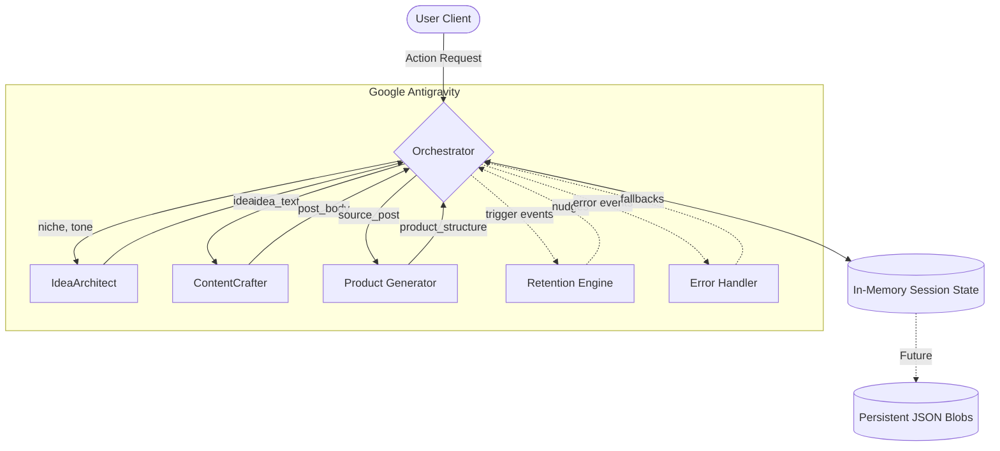

# Architecture – StudioFlow

## System Context

StudioFlow runs on **Google Antigravity** as a set of AI agents. No external databases initially – use in-memory session state and optional local storage. For production, data objects defined in PRD (User, Content Idea, Content Post, Product Conversion, Monetization Tracking) are stored as JSON blobs per user session.

## High-Level Architecture



## Data Models (from PRD)

Use these schemas for all agent outputs and state:

### 1. User Profile
```json
{
  "user_id": "string",
  "niche": "string | null",
  "tone_preference": "casual | professional | educational",
  "platform_focus": "TikTok | X | Instagram | LinkedIn",
  "monetization_goal": "grow_audience | make_money | stay_consistent",
  "created_at": "timestamp"
}
```

### 2. Content Idea
```json
{
  "idea_id": "string",
  "user_id": "string",
  "niche": "string",
  "idea_text": "string",
  "category": "string",
  "status": "saved | used | archived",
  "created_at": "timestamp"
}
```

### 3. Content Post
```json
{
  "post_id": "string",
  "idea_id": "string",
  "platform_type": "TikTok | X | Instagram | LinkedIn",
  "content_body": "string",
  "engagement_prediction_score": "float | null",
  "status": "draft | exported | posted"
}
```

### 4. Product Definition
```json
{
  "product_id": "string",
  "source_post_id": "string",
  "product_type": "ebook | checklist | course | template",
  "title": "string",
  "content_structure": "object", // e.g., chapters, checklist items
  "monetization_price_suggestion": "number",
  "status": "draft | published"
}
```

### 5. Monetization Tracking
```json
{
  "tracking_id": "string",
  "user_id": "string",
  "content_id": "string",
  "conversion_type": "product_creation | purchase",
  "revenue_estimate": "number | null",
  "created_at": "timestamp"
}
```